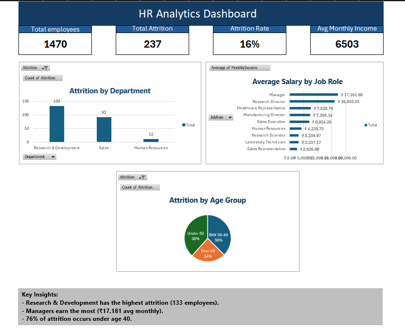

HR Analytics Dashboard (Excel Project)

📊 Overview
This project analyzes employee attrition, salary distribution, and demographics using Excel. The interactive dashboard helps HR teams understand workforce trends and retention challenges.

🧩 Key Insights
- Total Employees: 1470 | Attrition Rate: 16%
- Research & Development has highest attrition (133 employees)
- Managers earn highest average monthly income (₹17,181)
- 76% of attrition occurs under age 40

🛠 Tools & Techniques
- Excel Power Pivot
- PivotTables & PivotCharts
- Data Cleaning & Transformation
- KPI and Slicer Integration

📁 Project Structure
- `Raw Data` – Original employee dataset  
- `Cleaned Data` – Processed for analysis  
- `Analysis` – Pivot table metrics  
- `Dashboard` – Final interactive view  
- `README` – Project summary and notes  

👤 Author
Kishan Shetty 
BSc IT Graduate | Aspiring Data Analyst  
[linkedin.com/in/kishan-shetty-019170362]
